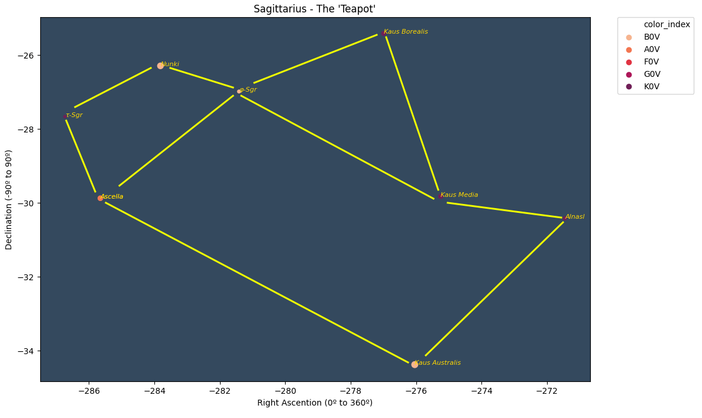
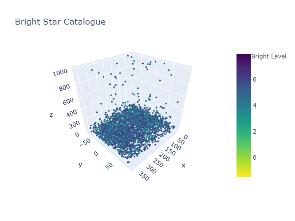
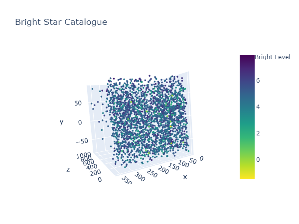
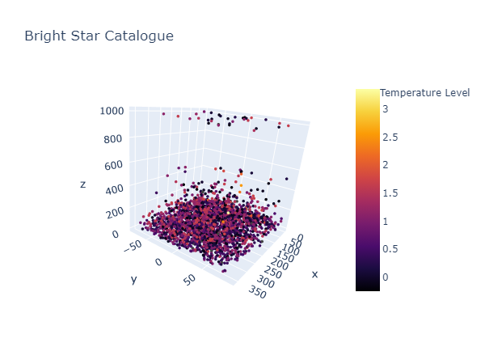
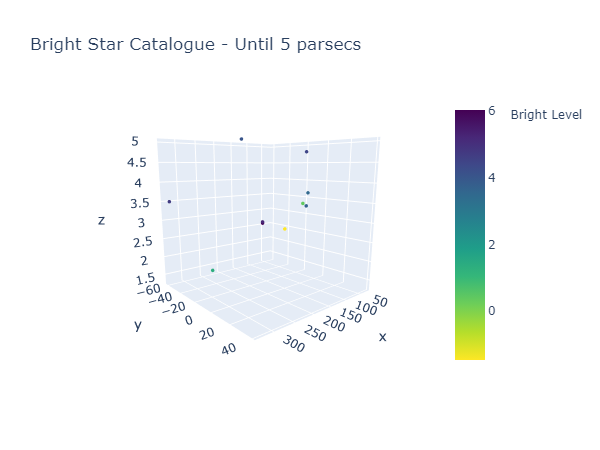

# Bright Stars Catalogue View

## Introdução

Este repositório mostrará o esforço de análise de dados relacionados de parte das estrelas da nossa galáxia, a Via Láctea. 

Astronomia é uma tema que não domino e passou longe da minha vida, mas fiz uma viagem ao Atacama/Chile no inverno de 2023 (_el desierto es helado cómo la wea..._) para ver as estrelas e fiquei tão fascinado com o que eu vi (as nebulosas, galáxias, e constelações) que pensei: "Será que há dados sobre o que testemunhei para analisar?". Há dados sobre as estrelas para a minha alegria. No entanto, é um terreno árido para a minha compreensão, pois eu sou mais de humanas (não, eu não entendo nada de astrologia também), mas eu sou um profissional de dados, e lidar com conceitos sob a ótica de dados auxilia na compreensão de temas que não domino ou que nunca depertaram a minha curiosidade!

Aqui está a minha foto no Atacama com as estrelas: 

Neste repositório será posto o notebook com as devidas manipulações e visualizações de dados, e permeia mais a ideia de visualizar as estrelas sob o prisma dos dados, do que fazer algo mais elaborado, como buscar evidências empíricas para certos questionamentos. Não tenho carga intelectual ou de conhecimento para fazer perguntas sobre os cosmos, isto é algo que faço com facilidade em temas de negócio ou sócio-econômicos, mas no terreno da Física... Esquece!

Faço uso de um Python notebook para construir as visualizações, que são simples, no entanto, faço o uso inédito (para mim) de gráficos 3D, as quais nunca tiveram serventia até necessitar observar as estrelas por meio de 3 dimensões ao mesmo tempo.

## Descobertas

Não houve a intenção de mapear todas as estrelas da nossa galáxia, mas sim, de fazer uso de uma base mais intuitiva de astronomia, com o objetivo de entender melhor sobre esse campo interessante do conhecimento.

Entende-se que o Henry Draper Catalogue (HD) é um dos mais famosos catálogos de estrelas, mas não é o único, e há outros melhores, como o do Bright Star Catalogue (BSC), que foi  a principal fonte de dados para este repositório. Mesmo o BSC não encerra a possibilidade de usar outros catálogos/bases, como o da missão Hipparcos (HIP), por exemplo. É preciso enfatiza que __não existe um catálogo definitivo__ que agrega todas as estrelas, pois há diferentes pesquisas/missões, tecnologias de observação para montar tais bases. 

Insistiu-se em usar algo que possibilite obter e conectar os nomes mais poéticos das estrelas, tal como Beta Centauri ou Alpha Escorpião (Antares), por exemplo, para ajudar na identificação e familiarização com os dados. Uma estrela com o nome HR 9054 não me diz muita coisa. 

Houve melhor compreensão de como são as variáveis mais básicas usadas pela astronomia, como ascensão direta (right ascention - RA), paralaxe (parallax) e declação (declination - DEC), e como elas podem ser combinadas em diversas visualizações. 

Muitos conceitos básicos de astronomia (que aprendi no deserto do Atacama) conseguiram ser aplicados na base de dados, como entender a intensidade do brilho das estrelas (magnitude delas), e de que as estrelas mais azuis, são as mais quentes (uso dos dados de fotometria BV). 

Houve sucesso em desenhar algumas constelações famosas através dos dados, conforme é demonstrado abaixo com a constelação da "Chaleira": 

O fato de precisar inverter o RA para ter a perspectiva terráquea (primeira vez que uso, de forma séria, essa palavra) das constelações, foi algo que me deixou intrigado!

Entretanto, entende-se, sobretudo ao tentar replicar a constelação de Yakana, que para conseguir enxergar aquilo que foi visto no Atacama, será necessário fazer uso de dados de nebulosas (cluster de estrelas), mas isso será feito futuramente. 

### Sobre a visualização 3D

Há várias formas de construir visualizações 3D no Python, mas parece que o `plotly` fornece algo mais adequado para combinar 3 variáveis num gráfico. O que se pode extrair, por enquanto é o seguinte: 

* Usou-se o `Scatter3D`, mas mesmo dentro do módulo, há outras alternativas como `scatter_3d`. 
* Não vale a pena converter a paralaxe em graus para combinar com as demais variáveis nas visualizações de dados. Deixe em _parsecs_ mesmo. Pensou-se em usar anos-luz, mas não foi necessário. 
* Mesmo com 3 dimensões, as paletas de cores "viridis" e "rocket" se mostraram ótimos para expressar as ideias de brilho e temperatura das estrelas. 
* A paralaxe, como medida de mensuração de distância, possui limites que são até mesmo perceptíveis nos dados, especialmente ao observar a homogeneidade de distância de muitas estrelas em faixas de _parsecs_, como 1000, por exemplo. Mas isso faz parte das limitações do instrumento, e [este vídeo](https://www.youtube.com/watch?v=Op3AYaJc0Xw) deixa claro isso de forma didática. 

Abaixo, há algumas imagens da visualização 3D, e nota-se na primeira imagem que muitas estrelas, com a distância (trigonométrica) calculada pela paralaxe, tendem a se concentrar em até 100 parsecs de distância. 

Ao rotacionar o gráfico (o `plotly` permite), são obtidas novas perspectivas, como esta: 

Pode-se mudar a coloração dos marcadores para captar a questão de temperatura das estrelas, e mesmo nuam perspectiva 3D, entende-se que há poucas estrelas "frias" nessa amostra de estrelas da galáxia. 

Os gráficos 3D , especialmente ao limtar a distância, consegue deixar muito nítida a vastidão da nossa galáxia (a Via Látea é uma dentro de milhões). Todos esses pontos abaixo são as estrelas mais próximas do nosso sistema solar

Por fim, tentou-se inserir no README as visualizações 3D do `plotly` (até mesmo ao inserir como objeto html, o `bsc_basic.html`), mas há muitas limitações no Github. Acredito que é possível, mas isso será feito posteriormente. Um futuro desafio?

Se este notebook tiver uma linha de continuidade e raciocínio heterodoxa, parte-se da premissa que buscou-se mais explorar os dados e combinar aquilo que escutei no deserto do Atacama, mas críticas sempre são bem-vindas. 